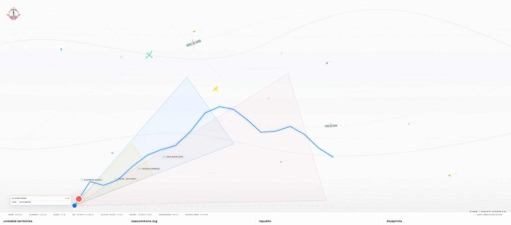

# Matteo Messina

Creative technologist and researcher building open-source software at the intersection of art, territory and applied technology. Based in Milan.

I run **[suezcanal.xyz](https://www.suezcanal.xyz)**, a research and development studio producing web platforms, simulations, field devices and public experiments around maritime space, evidence and geopolitical power.

## Selected work

**[SeaCommons](https://github.com/suezcanalxyz/seacommons)** · Python — Open-source maritime rescue and awareness platform: vessel tracking, weather, drift modelling and forensic operations. [Live](https://www.suezcanal.xyz/seacommons/)

**[suezcanal.xyz](https://www.suezcanal.xyz)** — Studio site and research platform for territory, maritime space and public-facing simulations.

**Artemis** · TypeScript — Workspace platform for artists and studios: auth, Postgres/Redis backend, artwork catalog, subdomain publishing, opportunity intake API. In development.

**[Insulaphilia](https://insulaphilia-org.vercel.app)** · TypeScript — Partner portal for the Insulaphilia Foundation.

**[Lazy Studio](https://lazystudio.vercel.app)** — Documentary and film production studio site, Rome. Launching soon.

## Recognition

Malta Biennale 2024 · WRO Media Art Biennale 2021 · Roppongi Art Night 2021 · University of Oxford (OxBAT) · Venice Architecture Biennale (Swamp Pavilion)

## Get in touch

[republic@suezcanal.xyz](mailto:republic@suezcanal.xyz) · [suezcanal.xyz](https://www.suezcanal.xyz)
